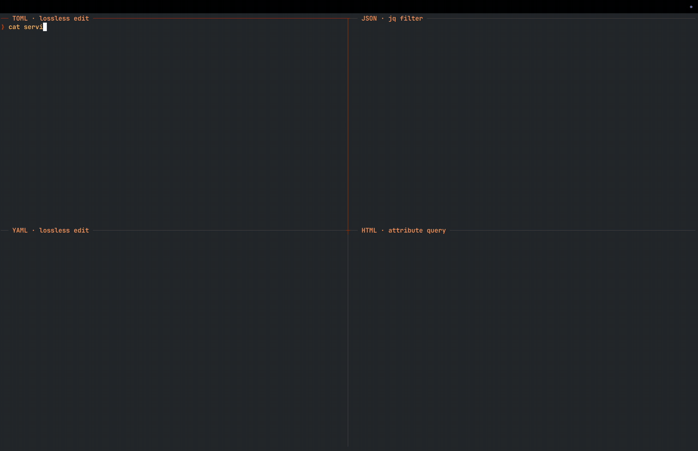

# jqf

jq's language, for every format, that edits files in place without destroying them.

Same jq programs, faster, with memory controls, without touching the bytes that don't need to be touched.



## Examples

### JSON — edit the file in place

```console
$ cat config.json
{
  "name": "app",
  "port": 8080,
  "tags": ["a", "b"]
}

$ jqf --in-place --edit '.port = 9090' config.json

$ cat config.json
{
  "name": "app",
  "port": 9090,
  "tags": ["a", "b"]
}
```

### YAML — add a key, leave the comments

```console
$ cat config.yaml
# Deploy owns this name. Changing it orphans the service registry.
name: checkout
# Public HTTPS port. Matches the Service spec.
port: 8080

$ jqf --edit '.retries = 3' config.yaml
# Deploy owns this name. Changing it orphans the service registry.
name: checkout
# Public HTTPS port. Matches the Service spec.
port: 8080
retries: 3
```

### TOML — change a value and write comments in one program

`.@` is jqf's accessor for comments.

```console
$ cat cfg.toml
name = "checkout"
port = 8080

$ jqf --edit '.port = 9090 | .port.@comment = ["owned by platform", "do not change without a ticket"] | .port.@comment_inline = ["matches the Service spec"]' cfg.toml
name = "checkout"
# owned by platform
# do not change without a ticket
port = 9090 # matches the Service spec
```

With no format flags, jqf is a strict JSON-in, JSON-out jq. A named file's format follows its extension; stdin is JSON; `--input-format` / `--output-format` override either.

## Formats

`jqf --list-formats` is the live table. `jqf --help-format yaml` is one page.

| Format | In | Out | Edit |
| --- | :-: | :-: | :-: |
| JSON | ✓ | ✓ | ✓ |
| JSONC / JSON5 | ✓ | ✓ | ✓ |
| NDJSON / JSON text sequences | ✓ | ✓ | — |
| YAML | ✓ | ✓ | ✓ |
| TOML | ✓ | ✓ | ✓ |
| CSV / TSV | ✓ | ✓ | ✓ |
| CBOR | ✓ | ✓ | ✓ |
| CBOR sequences | ✓ | ✓ | — |
| XML | ✓ | ✓ | ✓ |
| HTML | ✓ | ✓ | — |
| MessagePack | ✓ | ✓ | ✓ |
| INI / Java properties / dotenv | ✓ | ✓ | ✓ |
| `render` (tables and trees) | — | ✓ | — |

Not shipped yet: Arrow, Parquet, Markdown, HCL, shell, and filesystem (a directory tree as a jq document — walk a root, query names/sizes/types, load file contents through the codec registry).

## Beyond jq

jqf is a complete jq. It also edits files without rewriting them, follows live logs, and caps memory — things jq does not do.

- **Editing.** `--edit`, `--in-place`, `--diff`. Assignments patch the original bytes. An identity run is byte-verbatim.
- **Facts.** Read and write comments, tags, and markup attributes with `.@` and `.&`.
- **`--explain`.** The plan the engine derived: demand class, pushdown, chosen route, cost snapshot.
- **`--max-rss`.** A physical-memory governor, on by default.
- **`--follow`.** A live tail. Records publish as they arrive; a truncated last record is held.
- **`serve`.** Compile once. Serve NDJSON sessions over a unix socket or loopback TCP.

## Performance

On small files, wall time is process startup — performance alone is not a reason to switch. From a few megabytes of input (thousands of records; the panel’s 5k-wide JSON is ~5 MB) jqf is faster than [jq](https://github.com/jqlang/jq), [jaq](https://github.com/01mf02/jaq), [gojq](https://github.com/itchyny/gojq), [yq](https://github.com/mikefarah/yq), [dasel](https://github.com/TomWright/dasel), and [miller](https://github.com/johnkerl/miller) on most workloads. jaq is the closest; jqf does not win every cell. On large documents the RSS gap is often larger than the time gap.

The public harness is [`benchmark/`](benchmark/README.md). `make bench` builds the PGO binary. A snapshot of one run is [`benchmark/results.md`](benchmark/results.md). The snapshot is not in any way evidence, it should be treated as performance signal only.

## Where jqf differs from jq

A jq program should answer the same here, except the places below. Everything else — more formats, `--edit`, `--follow` — is additive and does not change those programs. The catalogue is [Using jqf as jq](docs/from-jq.md).

**Exact arithmetic.** jq computes in IEEE doubles. jqf uses exact decimals. `0.1 + 0.2` is `0.3`, `[100.0, 200.0] | add` does not pick up binary-float error, and a 19-digit id keeps its low bits. This is the one divergence that can change a result silently. A pipeline that captured jq's output byte for byte will see different numbers; there is no switch for jq's rounding.

**Strict JSON.** jqf refuses `01`, `+1`, `.5`, `1.`, and invalid UTF-8 in strings, where jq repairs them. `--strictness lenient` opts the number classes back in. Invalid UTF-8 still refuses.

**Dates and bytes.** TOML, YAML, and CBOR keep dates and byte strings as themselves. `type` therefore has eleven answers, not jq's six (`"localdate"`, `"bytes"`, …). A ported `if type == "string"` program falls through. `--types-as-strings` makes the temporals look like strings; byte strings are not covered by that dial.

**Memory ceiling.** `--max-rss` is on by default at 80% of the machine. A runaway `[inputs]` is refused (exit 5) instead of an OOM kill. Raise it, or pass `--max-rss 0`. jq has no ceiling.

**Regex.** A Rust engine, not Oniguruma. Five catalogued corners differ: zero-width scan advances by codepoint, not byte; look-behind with no fixed width is accepted; the `l` flag is not Oniguruma-longest; a capture inside a zero-width look-ahead keeps the captured text; compile-error wording differs.

**CLI.** `--argfile` is not accepted (use `--slurpfile`). `--debug-dump-disasm` and `--debug-trace` are unknown options; `--explain` is the analogue. `--build-configuration` prints jqf's own provenance, not jq's. Format flags, `--edit`, and `--follow` are extra.

## Docs

- [Architecture](docs/architecture.md)
- [Usage](docs/usage.md) — formats, editing, facts, memory, exit codes
- [Using jqf as jq](docs/from-jq.md)
- [jqf(1)](docs/jqf.1)

## Install

```console
$ cargo install jqf
$ brew tap filip-41/jqf && brew install jqf
```

Docs and an in-browser playground run on GitHub Pages:
<https://filip-41.github.io/jqf/> — [playground](https://filip-41.github.io/jqf/assets/playground/).

Cargo and Homebrew are source builds (`build=plain`). `install.sh` uses a checksummed PGO archive when a release provides one and otherwise falls back to Cargo. From git HEAD: `cargo install --git https://github.com/filip-41/jqf jqf`. From a clone: `make pgo`. `jqf --diagnostics` prints which.

Stable Rust, edition 2024, MSRV 1.96. Shell completions (bash / zsh) live in `tools/completions/`. The man page is `docs/jqf.1`.

Dual-licensed MIT OR Apache-2.0.
